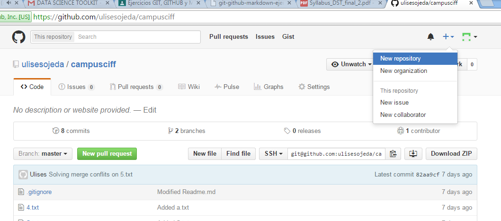
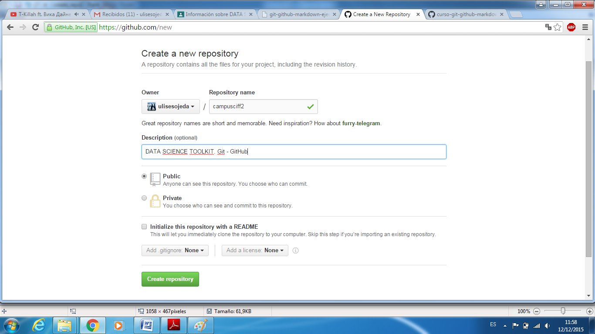
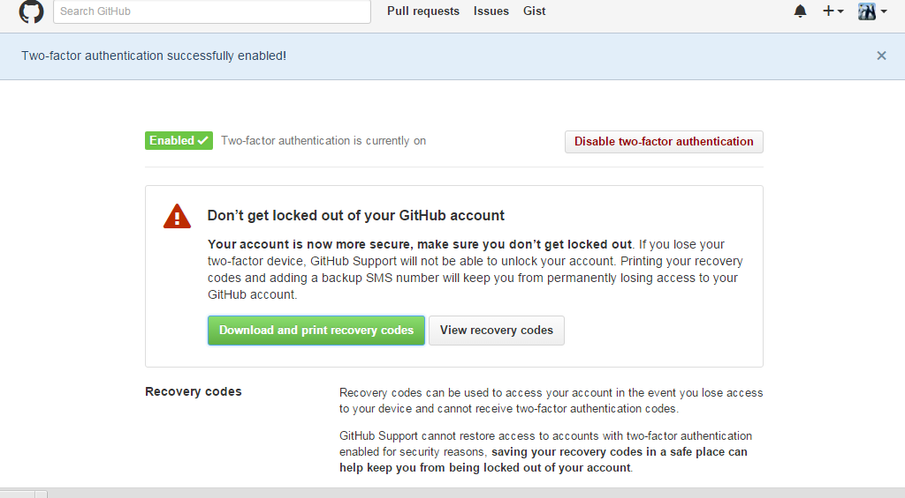
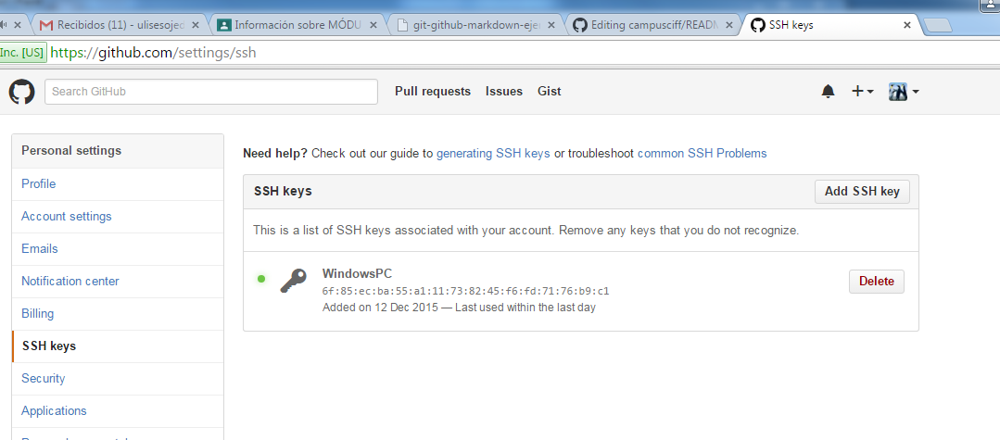
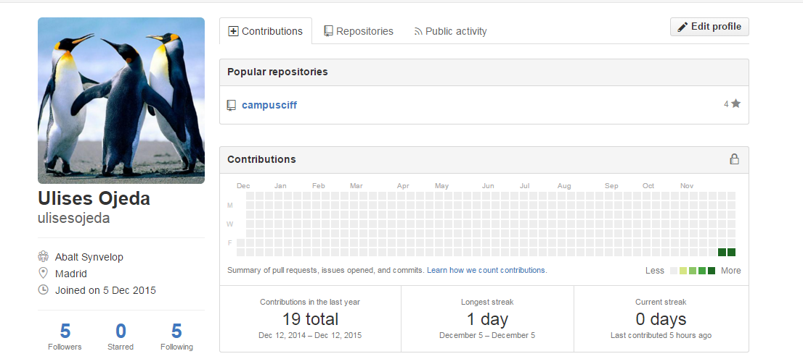
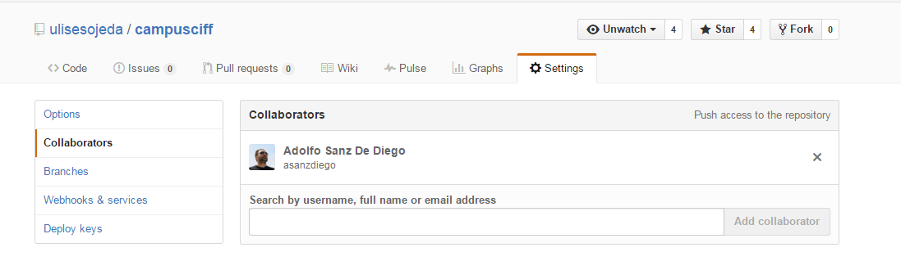

#Data Science Toolkit. Ejercicios Git - Github - Markdown. CIFF
##Crear repositorio campusciff. Nota: El repo campusciff fue creado durante la sesión de clases. A modo de ilustración se muestran los pasos para crear el repo campusciff2.

##Clonar vuestro repositio en local
- git clone git@github.com:ulisesojeda/campusciff.git

##Añadir al README.md los comanddos utilizados hasta ahora y hacer un coomit inicial con el mensaje commit inicial.
- git add .
- git commit -m "commit initial"

##Subir los cambios al repositorio remoto
- git push origin master

##Crear en el repositorio local un fichero llamado privado.txt
- touch privado.txt

##Crear en el repositorio local una carpeta llamada privada.
- mkdir privada

##Realizar los cambios oportunos para que tanto el archivo como la carpeta sean ignorados por git.
- Para que los ficheros sean ignorados por git deben ser incluidos en fichero .gitignore

##Añadir fichero1.txt al repositorio local
- touch fichero1.txt

## Crear un tag v0.1
- git tag -a v0.1 -m "On tag v0.1"

## Subir los cambios al repositorio remoto
- git push --tag origin master

## Crear una rama v0.2
- git branch v0.2

## Posiciona tu carpeta de trabajo en esta rama
- git checkout v0.2

## Añadir un fichero2.txt en la rama v0.2
- touch fichero2.txt

## Subir los cambios al repositorio remoto
- git add .
- git commit -m "Added fichero1.txt and fichero2.txt"
- git push origin v0.2

## Posicionarse en la rama master
- git checkout master

## Hacer un merge de la rama v0.2 en la rama master
- git merge v0.2

## En la rama master poner Hola en el fichero 1.txt y hacer commit.
- Utilizar vim para modificar fichero1.txt
- git add .
- git commit -m "Modified fichero1.txt"

## Posicionarse en la rama v0.2 y poner Adios en el fichero 1.txt y hacer commit
- git checkout v0.2
- Modificar fichero1.txt con vim
- git add .

## Posicionarse de nuevo en la rama master y hacer un merge con la rama v0.2 
- git checkout master
- git merge v0.2

## Listar las ramas con merge y las ramas sin merge
- git branch --merged
- git branch --no-merged

##  Arreglar el conflicto anterior y hacer un commit
- Utilizar vim para eliminar las marcas de las diferentes branchs.
- git add .
- git commit -m "Solved conflit during merge"

## Crear un tag v0.2. Nota: Se utiliza v0.3 pués v0.2 fue creada durante la sesión de clases.
- git branch v0.3

## Borrar la rama v0.2. Nota: Idem
- git branch -d v0.3

## Listar los distintos commits con sus ramas y sus tags.
- git config --global alias.list 'log --oneline --decorate --graph --all'
- git list

# Poner una foto en vuestro perfil de GitHub.
- Done

#Poner el doble factor de autentificación en vuestra cuenta de GitHub.

# Añadir (si no lo habéis hecho ya) la clave pública que se corresponde a tu ordenador.

# Preguntar los nombres de usuario de GitHub de tus compañeros de clase, búscalos, y sigueles.

# Seguir los repositorios campusciff del resto de tus compañeros.
- Done

# Añadir una estrella a los repositorios campusciff del resto de tus compañeros
- Done

# Crear una tabla de este estilo en el fichero README.md con la información de varios de tus compañeros de clase
| NOMBRE | GITHUB |
| ------ | ------ |
| Pablo Lopez | <https://github.com/plopez76/> |
| David Pacheco | <https://github.com/davpacheco/> |
| Diego Martin | <https://github.com/diegomartincastellanos/> |
| Sergio Torres | <https://github.com/sergiotorrespalomino/> |
| Patricia Iglesias | <https://github.com/Pimateos/> |

# Poner a github.com/asanzdiego como colaborador del repositorio campusciff

# Crear una organización llamada campusciff-tunombredeusuariodegithub
- Done

# Crear 2 equipos en la organización campusciff-tunombredeusuariodegithub, uno llamado administradores con más permisos y otro colaboradores con menos permisos.
- Done

## Meter a github.com/asanzdiego y a 2 de vuestros compañeros de clase en el equipo administradores.
- Done

## Meter a github.com/asanzdiego y a otros 2 de vuestros compañeros de clase en el equipo colaboradores.
- Done

## Crear un index.html que se pueda ver como página web en la organización

